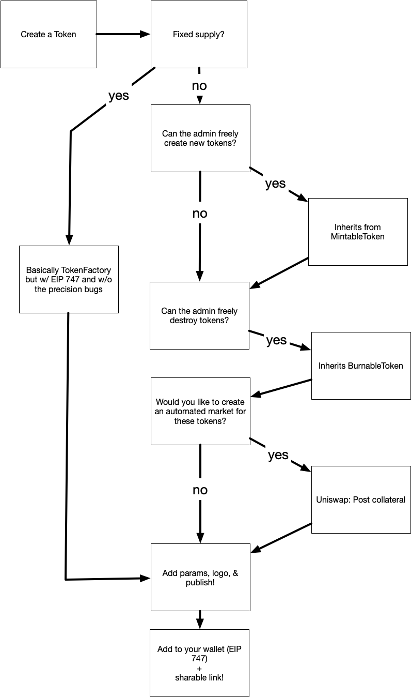

# `rpc-cap` [](https://circleci.com/gh/MetaMask/rpc-cap)

## JSON RPC Capabilities Middleware 

A module for managing basic [capability-based security](https://en.wikipedia.org/wiki/Capability-based_security) over a [JSON-RPC API](https://www.jsonrpc.org/) as a middleware function for [json-rpc-engine](https://www.npmjs.com/package/json-rpc-engine), to instantly add a user-consent based permissions system on top of any JSON-RPC API.

Requires that you are able to authenticate a requesting `domain`, which can be any unique string you use to identify a remote entity, be it a user ID whose cookie you've verified, or a public key that you've challenged:

## Minimal Example

A fairly minimal server example, hosted over a [socket.io-like](https://www.npmjs.com/package/socket.io) server API.

```typescript
const JsonRpcEngine = require('json-rpc-engine');
const RpcCap = require('rpc-cap');

// Here we will restrict access to subsequent functions:
const capabilities = new RpcCap({
  restrictedMethods: {

    // Restricted methods themselves are defined as
    // json-rpc-engine middleware functions.
    'unlockDoor': {
      description: 'Allows unlocking a Very Special door.',
      method: (req, res, next, end) => {
        unlockDoor();
        res.result = 'Unlocked!';
        end();
      }
    }
  },

  // This library also depends on your ability to present the request
  // To an entity in charge of administrating permissions:
  requestUserApproval: async (domainInfo, req) => {
    return checkIfUserTrusts(domainInfo, req);
  }
});

function createPermissionedEngine (domain) {
  const engine = new JsonRpcEngine();
  engine.push(capabilities.providerMiddlewareFunction.bind(capabilities, domain)))
  return engine
}

// Imagine a very standard server-response framework, here I'll use
// something like socket.io:
server.on('connection', (socket) => {

  // It is a critical security assumption that these connections can be authenticated outside of this framework:
  const domain = authenticateConnection(socket);
  const engine = createPermissionedEngine(domain);

  socket.on('message', (message, response) => {
    engine.handle(message, (err, response) => {
      socket.emit('request', response);
    })
  })
})
```

## Resulting API

Once this middleware is added to a server that is directing requests to a [JsonRpcEngine](https://github.com/MetaMask/json-rpc-engine), it adds some new methods to the RPC server:

- `getPermissions`: For listing the currently available restricted methods.
- `requestPermissions`: For requesting additional permissions from the user.

## Installation

`yarn add rpc-cap`

## Usage

The capability system is initialized with a variety of options, and is itself a [gaba](https://github.com/MetaMask/gaba/) compatible controller, which defines how new permissions are persisted to state, and how they are restored in the constructor.

Once initialized, it exposes a special [AuthenticatedJsonRpcMiddleware](https://github.com/MetaMask/rpc-cap/blob/master/src/%40types/index.d.ts#L7-L15) type method `providerMiddlewareFunction(domainInfo, req, res, next, end)`, which requires an assumed-authenticated `domain` object, followed by normal `json-rpc-engine` middleware parameters.

It simply passes through methods that are listed in the optional `safeMethods` array, but otherwise requires the requesting domain to have a permissions entry.

This module is written in TypeScript, and so type definitions can be found in [our types file](./src/@types/index.d.ts).

## API

### RPC Methods

Here is a more detailed look at the methods that are added to a JSON-RPC service using this module.

#### getPermissions() => IOcapLdCapability[]

```typescript
engine.handle({
  method: 'getPermissions'
}, (err, result) => {
  console.log(result);
  /**
   * [{ parentCapability: 'sendEmail' ... }]
   **/
})
```

If the `method` requested is `getPermissions` (optionally preceded by `methodPrefix`), the response will be an array of capability objects, which each represent the permission to call a function, with the key `parentCapability` to indicate the restricted method's name.

```typescript
interface IOcapLdCapability {
  // An array of strings describing this resource, and pointing at this documentation.
  "@context": string[];

  // A GUID representing this method.
  id: string;

  // The restrictedMethod name:
  parentCapability: string;

  // The recipient's internal domain identifier:
  invoker: string;

  // The issuing date, in UNIX epoch time
  date?: number;

  // An optional array of caveat objects.
  caveats?: IOcapLdCaveat[];
}

export type IOcapLdCaveat = {
  // A type identifying the type of caveat.
  type: string,
  // Any additional data required to enforce the caveat type.
  value?: any;
}
```

Of particular interest will be the `caveats` array, which will eventually be customizable by the platform, and describe possible limitations being imposed on the way that particular method is called:

##### Currently Supported Caveats

Currently all supported caveats can be found in the [Caveats.ts file](./src/caveats.ts), which should be expected to be significantly expanded over time.

Right now the supported caveat types are simple, to demonstrate the concept:

- requireParams: Ensures that the method can only be called with a superset of some hard-defined parameters.
- filterResponse: Ensures that the response will only include explicitly permitted values in it (if an array).
- limitResponse: Ensures that the response will only include a maximum number of entries as defined by the value (if an array).
- forceParams: Overwrites the params of all calls to the method with a specified list of params.

Some caveat types we are looking forward to supporting eventually:

- Expiration caveat
- Invocation limit
- Total sum caveat
- ???

#### requestPermissions (IRequestedPermissions)

```typescript
// @types

interface IRequestedPermissions { [methodName: string]: IMethodRequest }
type IMethodRequest = Partial<IOcapLdCapability>;

// Here is the relevant subset of this object:
interface IOcapLdCapability {
  // An optional array of caveat objects.
  caveats?: IOcapLdCaveat[];
}

type IOcapLdCaveat = {
  // A type identifying the type of caveat.
  type: string,
  // Any additional data required to enforce the caveat type.
  value?: any;
}
```

A sample permissions request:

```typescript
engine.handle({
  method: 'requestPermissions',
  params: [
    {
      unlockDoor: {},
      composeMessage: {},
      sendEmail: {
        caveats: [
          {
            type: 'requireParams',
            value: {
              to: 'only@my-address.com',
            }
          }
        ]
      },
    }
  ]
})
```

As you can see, each requested permission includes an options object, which can specify `caveats` that the requestor is willing to work within.

The simplest permissions request has no `caveats`, but by including caveats, the requestor puts in a little extra effort to give the authorizer a bit more comfort and confidence in approving the requested permissions.

### Constructor Options

If consuming this module for your own JSON-RPC API, here are the options required to configure and use this module:

#### initState?: CapabilitiesConfig

Our persistence model depends on the gaba architecture, which means state updates are emitted via `controller.subscribe((update) => {/* handle update */});`

This `update` value should then be fed back in as the `initState` value.

Note this does mean each restricted engine's state is stored in a single blob, and so should not be used to manage overly large sets of permissions

#### methodPrefix?: string

An optional string that will be prepended to the automatically-inserted permissions methods, to allow namespacing and avoid name collisions.

- `getPermissions`: For listing the currently available restricted methods.
- `requestPermissions`: For requesting additional permissions from the user.

#### safeMethods?: string[]

An array of RPC `method` names that should be passed through this middleware for a latter middleware to handle, with no permissions required.

#### engine?: JsonRpcProviderEngine

An optional reference to the parent `json-rpc-engine` instance, which will be passed to the `restrictedMethods` so that they can call other methods on the host within the same restricted domain.

For example, a restricted method `sendEmail` may depend on another restricted method, `composeEmail`. In this case, the `engine` parameter allows easy composition of restricted methods.

```typescript
  restrictedMethods: {
    composeEmail: {
      description: 'Assigns a copy writer the task of authoring a beautiful text.',
      method: async (req, res, next, end) => {
        const text = await commissionCopyWriting(req);
        res.result = text;
        end();
      }
    }

    // Note the optional `engine` parameter here:
    // This engine is the same restricted engine that was passed in
    // as a parameter.
    'sendEmail': {
      description: 'Sends a beautiful text to the requested recipient.',
      method: (req, res, next, end, engine) => {
        engine.handle({ method: 'composeEmail' }, (err, result) => {
          sendEmail(result);
          res.result = 'Sent!';
          end();
        })
      }
    }
  },

```

#### restrictedMethods: RestrictedMethodMap

This `RestrictedMethodMap` is a type described like this.

The `description` of a `RestrictedMethodEntry` should be something that could be presented to the user/administrator to decide whether they should authorize this permission to the requesting `domain`.

The `PermittedJsonRpcMiddleware` is just like a normal `json-rpc-engine` middleware, except it can optionally receive a reference to the parent restricted `engine`, for the sake of making permitted requests within the restricted domain.

```typescript
interface RestrictedMethodMap {
  [key: string]: RestrictedMethodEntry;
}

interface RestrictedMethodEntry {
  description: string;
  method: PermittedJsonRpcMiddleware;
}

interface PermittedJsonRpcMiddleware extends JsonRpcMiddleware {
  (req: JsonRpcRequest<any>, res: JsonRpcResponse<any>, next: JsonRpcEngineNextCallback, end: JsonRpcEngineEndCallback, engine?: JsonRpcEngine): void;
}
```

#### requestUserApproval: UserApprovalPrompt

```typescript
interface UserApprovalPrompt {
  (permissionsRequest: IPermissionsRequest): Promise<IRequestedPermissions>;
}

interface IPermissionsRequest {
  origin: string;
  metadata: IOriginMetadata;
  permissions: IRequestedPermissions;
}

interface IOriginMetadata {
  id?: string;
  origin: IOriginString;
  site?: {
    name?: string,
    icon?: any,
  }
}

interface IRequestedPermissions { [methodName: string]: IMethodRequest }

type IMethodRequest = Partial<IOcapLdCapability>

interface IOcapLdCapability {
  "@context": string[];
  // A GUID representing this method.
  id: string;
  // A pointer to the resource to invoke, like an API url,
  // or the method name (in the case of a local API).
  parentCapability: string;
  // A globally unique identifier representing the valid holder/invoker of this capability.
  invoker: string;
  // The issuing date, in UNIX epoch time
  date?: number;
  // An optional array of caveat objects.
  caveats?: IOcapLdCaveat[];
  proof?: IOcapLdProof;
}
```

A promise-returning function representing

You can see our `IMethodRequest` objects, along with our internal permissions storage, are in a schema based on the [ocap-ld](https://w3c-ccg.github.io/ocap-ld/) proposal, which may allow us to add signatures to these permissions in the future. That would allow:

- Clients to back up their own permissions instead of the server storing permissions tables.
- Unauthenticated, stateless connections, which are authenticated by signed "invocations" by the keys that these permissions would be signed "to".

None of these features are used yet, but we've used this schema internally to provide an interesting possible future path for the project.

## A more detailed Example

```javascript
const Engine = require('json-rpc-engine')
const CapabilitiesController = require('rpc-cap')

const capabilitiesConfig = {

  // Supports passthrough methods:
  safeMethods: ['get_index']

  // If you want restricted methods to have access to other methods within this scope,
  // You can provide a json-rpc-engine instance here:
  engine,

  // optional prefix for internal methods
  methodPrefix: 'wallet_',

  restrictedMethods: {

    // Restricted methods themselves are defined as
    // json-rpc-engine middleware functions.
    'send_money': {
      description: 'Allows sending your money away freely.',
      method: (req, res, next, end) => {
        sendMoney()
        res.result = 'Success!'
        end()
      }
    },

    // Restricted methods receive a simple engine that can be used
    // to easly call other methods within the same restricted domain:
    'send_much_money': {
      description: 'Sends money to a variety of recipients',
       method: (req, res, next, end, engine) => {
         Promise.all(req.params.map((recipient) => {
           return new Promise((res, rej) => {
             engine.handle({ method: 'send_money', params: [recipient] }, (err, result) => {
               if (err) return rej(result);
               res(result);
             });
           })
         }))
         .then(() => {
           res.result = 'Success!'
         })
       }
    }
  },

  /**
  * A promise-returning callback used to determine whether to approve
  * permissions requests or not.
  *
  * Currently only returns a boolean, but eventually should return any specific parameters or amendments to the permissions.
  *
  * @param {string} domain - The requesting domain string
  * @param {string} req - The request object sent in to the `requestPermissions` method.
  * @returns {Promise<bool>} approved - Whether the user approves the request or not.
  */
  requestUserApproval: async (domainInfo, req) => {
    const ok = await checkIfUserTrusts(domainInfo, req)
    return ok
  }
}

// Same state that is emitted from `this.store.subscribe((state) => {})`,
// Following the `obs-store` module framework.
// can be used to re-instantiate:
const restoredState = getPersistedState()

const capabilities = new CapabilitiesController(capabilitiesConfig, restoredState)

// Unlike normal json-rpc-engine middleware, these methods all require
// a unique requesting-domain-string as the first argument.
const domain = 'requestor.thatsite.com'
engine.push(capabilities.providerMiddlewareFunction.bind(capabilities, domain))
engine.start()
```

### Testing

To run unit tests: `yarn test`

To test against an example dapp, serve the example using `yarn serve` and explore using [this branch of MetaMask](https://github.com/MetaMask/metamask-extension/tree/LoginPerSite).

## Object Definitions

Most object type definitions can be found in [our types file](./src/@types/index.d.ts).

## Architecture



## Current Status

This module is in an exploratory MVP state and should not be used in production. It deserves more testing, scrutiny, consideration, and a healthy beta period before anyone should trust it with significant value.
