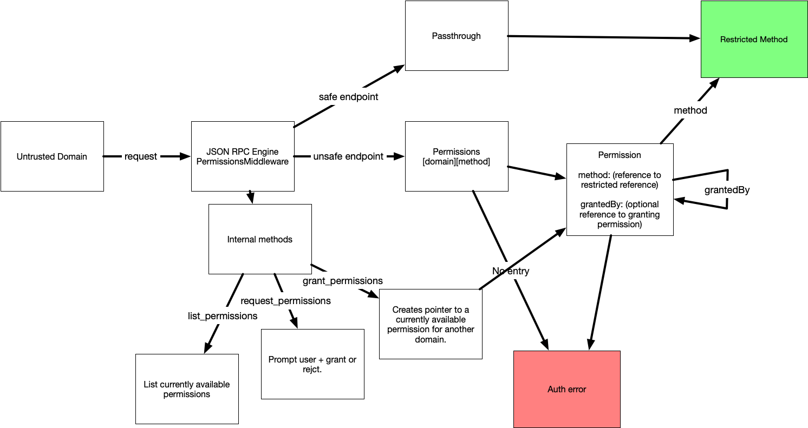

# JSON RPC Engine Capabilities

A module for managing permissions extended to an untrusted domain, and enforcing those permissions over a JSON-RPC API as a middleware function for [json-rpc-engine](https://www.npmjs.com/package/json-rpc-engine).



## Installation

`npm install json-rpc-engine-capabilities -S`

## Ideal Usage

```javascript
const Engine = require('json-rpc-engine')
const RpcCapabilities = require('json-rpc-engine-capabilities')

engine.push(new RpcCapabilities({

  // Supports passthrough methods:
  safeMethods: ['get_index']
  safeCheckingFunction,

  restrictedMethods: {
    {
      'method': 'send_money',
      validationFunction,

      // Description can be make confirmation UI easier to develop:
      description: 'Ability to send funds freely.'
      optionalTypeData,
      method: this.sendMoney.bind(this, send Money),
    }
  },

  requestUserApproval(async (domainInfo, restrictedMethod) => {
    const ok = await checkIfUserTrusts(domainInfo, restrictedMethod)
    return ok
  })

}))

engine.push(finalMiddleware)
engine.start()
```

The capabilities system also adds two new methods to the RPC, and you can modify what they are with a prefix of your chocie:

- `getCapabilities()` returns a list of capability descriptors.
- `requestCapabilities(capabilities)` prompts user approval of some capability.
- `useCapability(capability, params)` Performs the desired function.

### Important distinction

Some capabilities will prompt user approval. This is different than lacking the capability to perform that action. There are two different capabilities: The ability to perform an action without further confirmation, and the ability to suggest a possible action.

## Object Definitions

A capability descriptor as passed to the requestor in response to `getCapabilities()`:

```
{
  method: 'send_money',
  capability_id: 'STRONG_RANDOM_ID_LINK',
  description, // string
  optionalTypeData, // allows easy consumption of these dynamic methods.
}
```

